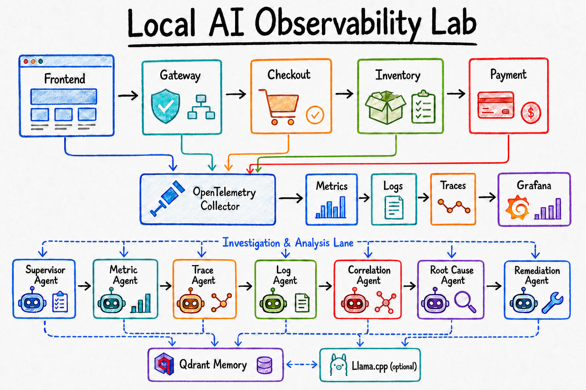

# AI Observability Lab - entirely local

This is a production-debugging simulation, not an autonomous remediator. Select
one or more safe failures, generate local traffic, then ask the agent workflow
an SRE-style question. The report is evidence-first and remediation suggestions
remain human-approved only.

## Architecture

`Frontend -> Gateway -> Checkout -> Inventory -> Payment`

Each service exports OpenTelemetry traces, metrics, and logs to the Collector.
The Collector sends traces to Tempo, logs to Loki, and metrics to Prometheus;
Prometheus remote-writes metrics to VictoriaMetrics. Grafana is provisioned with
all four data sources. The agent queries Prometheus, Loki, Tempo, and local
runbooks, then optionally produces a local llama.cpp summary.

See [the end-to-end flow diagram](docs/architecture.md).



## Start

```powershell
Copy-Item .env.example .env
docker compose up --build -d
```

Local endpoints:

- UI: http://localhost:5173
- Grafana: http://localhost:3000 (`admin` / `admin`)
- Agent API: http://localhost:8081/docs
- Collector health: http://localhost:13133

## Run a multi-failure exercise

1. Open the UI and select any combination of failures. One mode is allowed per
   service, but several services may fail simultaneously.
2. Click **Simulate selected failures**. The Agent API enables the modes and
   sends traffic through the normal frontend path and directly to every selected
   service so upstream faults cannot hide downstream evidence.
3. Wait 10 seconds for telemetry batching.
4. Use any question preset: checkout failure, dependencies, classification,
   safe mitigation, or correlated evidence.
5. Review the report in the **Incident memory** block, then click **Save
   reviewed report to memory** to approve persistence in the local Qdrant
   incident-memory collection.
6. Click **Clear all failures** when finished.

Available fault modes:

- Frontend worker overload
- Gateway rate limit
- Checkout Redis timeout
- Inventory reservation-database outage
- Payment database-pool exhaustion
- Payment-provider timeout
- Payment card decline

In Grafana Explore, query `checkout_stage_total` in VictoriaMetrics,
`{service_name=~"frontend|gateway|checkout|inventory|payment"}` in Loki, and
search Tempo for error traces.

## Investigation behavior

The workflow gathers metrics, logs, traces, correlation context, a relevant
local runbook, and similar approved incidents from Qdrant. Each backend query
is bounded to three seconds and returns partial evidence if a backend is
unavailable. Root-cause detection matches the current error-log signatures;
an unavailable observability backend is reported as evidence, rather than
hanging the API. Incident memory is never written without explicit approval.

llama.cpp is optional and never chooses the root cause. To enable an additional
local language-model summary (bounded to 300 seconds with a 4096-token context
and a 120-token response), set:

```env
ENABLE_LLM_SUMMARY=true
```

The llama.cpp container downloads the configured Hugging Face GGUF repository
on first start (`LLAMA_HF_REPO`, including its quantization tag) and caches the
Hugging Face blobs in the `llama-models` volume mounted at `/root/.cache`.
Recreate `agent-api` after changing `.env` or the skill files:

```powershell
docker compose up -d --build agent-api llama-cpp
```

The LLM output appears only as
`local_llm_summary`; the evidence-based `root_cause` field is independent.

The optional synthesis prompt loads the compact project skill at
`skills/incident-investigation/SKILL.md`. It injects only a short set of
evidence-first rules instead of repeating project history in every llama.cpp
request. This reduces instruction-token overhead; CPU inference time is still
controlled by `LLAMA_NUM_CTX`, `LLAMA_NUM_PREDICT`, and
`LLAMA_TIMEOUT_SECONDS`.

The memory API is `POST /api/memory/incidents`; it rejects writes unless the
request includes `approved: true`. Stored reports are embedded locally and
retrieved by similarity during later investigations.

## Troubleshooting telemetry

The Collector writes detailed debug batches for every received signal. If
Grafana is empty after a simulation, inspect:

```powershell
docker compose logs --tail=150 otel-collector
```

No debug batches means application-to-Collector OTLP ingress is failing. Debug
batches followed by exporter errors identify the affected backend.

## Project map

- `apps/`: five OpenTelemetry-instrumented services and fault modes.
- `otel/`: Collector receive, processing, export, health, and debug setup.
- `grafana/`, `victoriametrics/`, `tempo/`, `loki/`, `prometheus/`: local observability stack.
- `agents/`, `workflow/`, `tools/`: simulation API, LangGraph workflow, and bounded query clients.
- `runbooks/`, `vectorstore/`: local Markdown knowledge and Qdrant incident-memory storage.
- `ui/`, `faults/`, `tests/`, `docs/`: exercise controls, scripted demo, tests, and architecture documentation.

## Safety boundaries

The workflow is read-only after fault injection. Future remediation tools should
be separate, allowlisted capabilities requiring explicit human approval.
