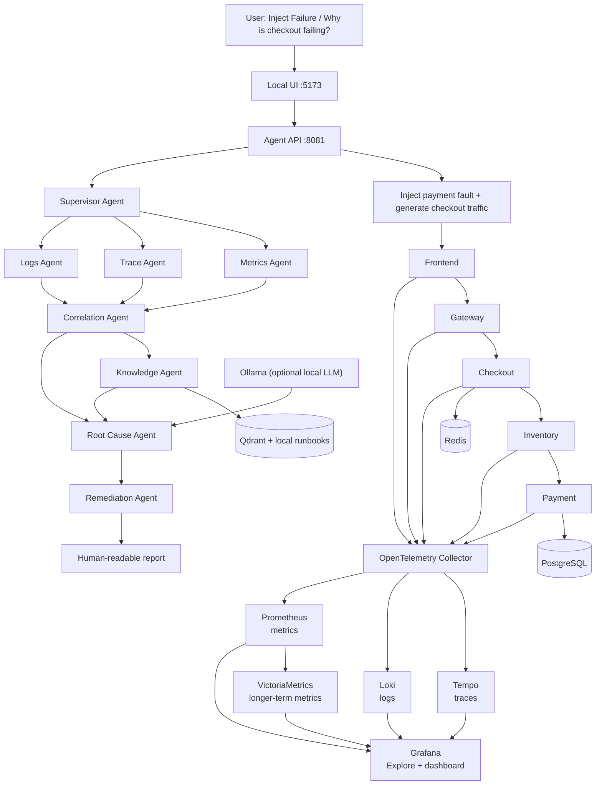

# Agent workflow

Supervisor → {Metrics, Traces, Logs} → Correlation → Knowledge → Root Cause → Remediation → Report.

The initial executable graph sequences the specialist calls so its evidence is deterministic. The next engineering step is to fan out Metrics/Traces/Logs concurrently, retain their individual timestamps, and add a human-approval edge before any action tool.

## End-to-end project flow

