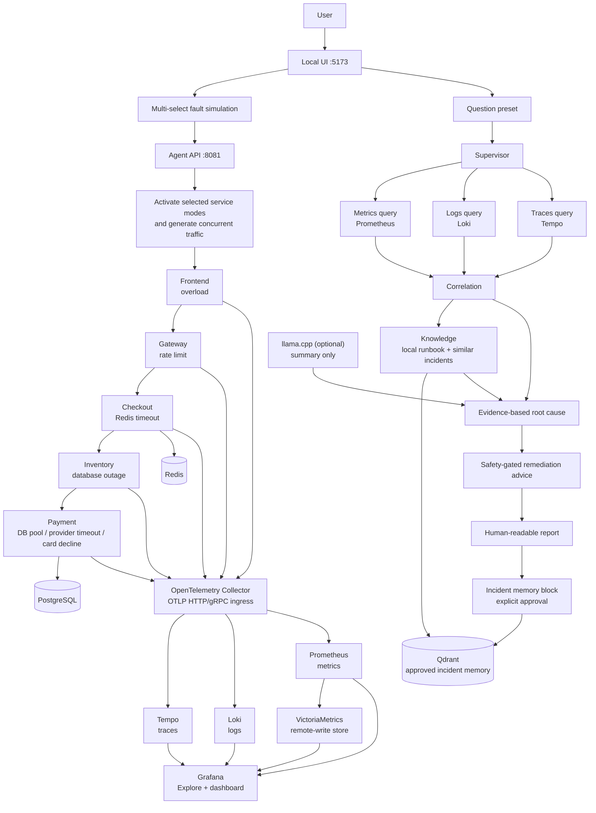

# Architecture and agent workflow

The UI can activate one failure mode per service and multiple services at once,
ask one of several question presets, and explicitly save a reviewed report from
the dedicated Incident memory block.
The Agent API clears unselected modes, activates selected modes, and generates
traffic both through the normal request chain and directly to selected services.
This produces evidence even when an upstream failure prevents normal propagation.

## Execution boundaries

- Each query client has a three-second timeout and returns partial evidence on
  backend errors.
- Root-cause detection uses known fault signatures in current logs; it does not
  depend on llama.cpp.
- llama.cpp, when enabled, receives a compact evidence prompt, requests a
  4096-token context by default, is capped at 300 seconds, and contributes only the
  `local_llm_summary` report field.
- Prometheus scrapes llama.cpp `/metrics` and agent-api `/metrics`; Grafana
  presents runtime throughput, queue/context pressure, latency, token usage,
  and summary success/error quality signals.
- No remediation is executed by the agent.
